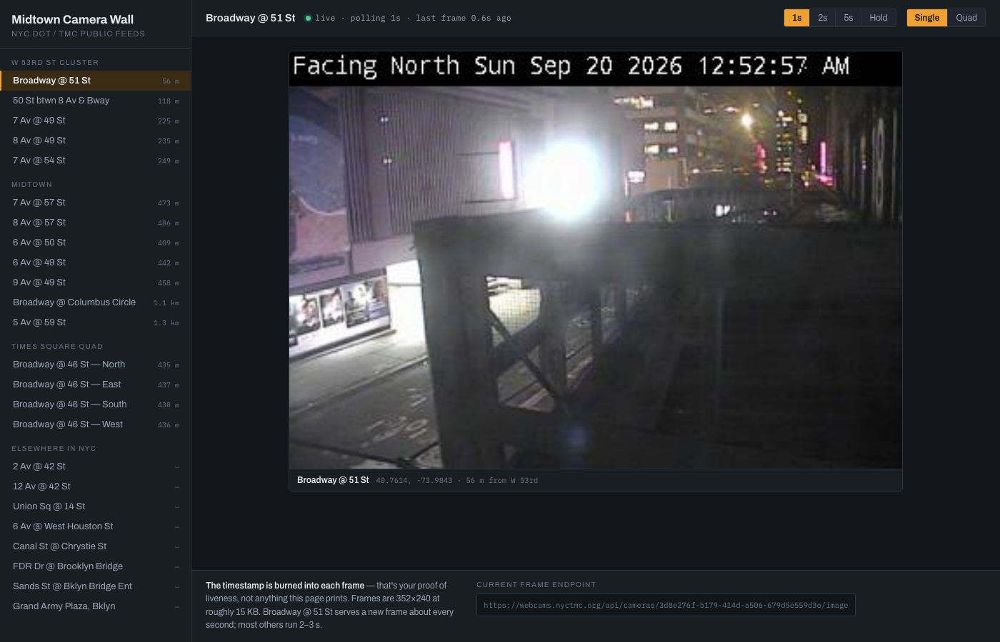

# Midtown Camera Wall

A single-file viewer for New York City's public DOT traffic cameras, focused on the Midtown / Hell's Kitchen cluster around W 53rd St.

**Live: https://alodda.github.io/nyc-street-cam/**



## What it does

- Carries **2,218 cameras** — the full NYC DOT/TMC index (983), the 511NY/NYSDOT network merged in, and three EarthCam broadcast streams. 1,284 carry live video
- **An interactive map picks the area.** Every camera is a dot; pan and zoom to choose a neighbourhood and the list and the wall follow the map bounds, nearest to the centre first. Click a dot to anchor on that camera
- Street map or satellite imagery, and shortcuts back to W 53rd St or out to all five boroughs
- The map position is written to the URL, so a link reopens the same view — for example [`#16/40.76260/-73.98400`](https://alodda.github.io/nyc-street-cam/#16/40.76260/-73.98400)
- **Search by address or place** — type `245 W 52nd St` or `August Wilson Theatre`, pick a result, and the map drops a pin and frames the address together with the cameras that cover it. Camera names are searched at the same time, in their own section
- Wall sizes of **1, 4, 6 or 10** tiles — the wall fills outward from the selected camera in distance order, so "10" gives the ten nearest feeds to wherever the map is pointed
- Opens on **Broadway @ 51 St**, the fastest camera on the block — a new frame roughly every second
- Refresh rate: 1s / 2s / 5s / Hold, with polls staggered across the interval so a full wall doesn't fire ten simultaneous requests
- Live / stale / offline indicator — amber after 6s with no new frame, red after three failed pulls
- Click any tile to make it the anchor; arrow keys step through the filtered list; space toggles Hold

## Data sources

Frames come straight from the NYC Traffic Management Center's public endpoint. No API key, no rate limit encountered at one request per second.

```
https://webcams.nyctmc.org/api/cameras/              # all 983 cameras, JSON
https://webcams.nyctmc.org/api/cameras/{id}/image    # current frame, JPEG
```

Each frame is 352×240 and about 15 KB, with the capture time burned into the top of the image. That burn-in is the real liveness check — the status line in the UI only reports what the page has managed to fetch.

Measured refresh cadence on the W 53rd cluster:

| Camera | Distance from W 53rd & Broadway | New frame every |
| --- | --- | --- |
| Broadway @ 51 St | 56 m | ~1s |
| 7 Av @ 54 St | 249 m | ~2s |
| 50 St btwn 8 Av & Bway | 118 m | ~2.5s |
| 8 Av @ 49 St | 235 m | ~2.5s |
| 7 Av @ 49 St | 225 m | ~3s |

## How it's built

`index.html` plus `cameras.json`. No build step; the only dependencies are two Google Fonts and Leaflet from cdnjs.

Geocoding runs two keyless services in parallel and merges them: [NYC GeoSearch](https://geosearch.planninglabs.nyc/) (Planning Labs) resolves street addresses authoritatively but knows no landmarks, and [Photon](https://photon.komoot.io/) knows landmarks. Nominatim would cover both but returns 403 to anything a browser can send, since it wants an identifying `User-Agent` that `fetch()` is not permitted to set.

Both basemaps are keyless. Every hosted dark basemap now wants an API key — CARTO's returns tiles stamped `API KEY REQUIRED` — so the dark map is plain OpenStreetMap raster inverted with a CSS filter, and satellite is Esri World Imagery. The 983 camera dots render through Leaflet's canvas renderer rather than as DOM markers.

Each tile is two stacked `` elements; the next frame loads into the hidden one and only swaps once it has decoded, so the image never flickers or flashes white between refreshes.

`cameras.json` is a trimmed snapshot of the TMC index — id, name, borough, coordinates, online flag — at 123 KB. It's fetched same-origin at load, which works on the hosted site. Opening `index.html` straight off disk makes that fetch fail, and the page falls back to nine cameras embedded in the source, so the local copy still runs.

To refresh the snapshot:

```bash
curl -s https://webcams.nyctmc.org/api/cameras/ | node -e '
const rows=JSON.parse(require("fs").readFileSync(0,"utf8"));
process.stdout.write(JSON.stringify(rows.map(c=>({
  i:c.id, n:c.name, a:c.area,
  y:+(+c.latitude).toFixed(5), x:+(+c.longitude).toFixed(5),
  o:String(c.isOnline)==="true"?1:0
}))));' > cameras.json
```

## Known limitation

The camera endpoint returns no `Access-Control-Allow-Origin` header. Displaying frames in an `` works fine, but anything that reads pixels does not — drawing a frame to a canvas taints it, so `toBlob()` and `captureStream()` both throw. That rules out in-page recording, timelapse export, or any client-side computer vision. Doing any of that needs a small proxy re-serving the frames same-origin.

It's also why the index ships as a committed file rather than being fetched live from the TMC: a browser can't read that endpoint cross-origin.

## What these cameras are not

These are traffic cameras: low-resolution, fixed, mounted high on a mast and pointed down a roadway. They show traffic flow and weather. They cannot resolve a face, a license plate, or a person. There is no public camera network in New York that can.

## Running locally

Clone and open the file — no server required.

```bash
git clone https://github.com/Alodda/nyc-street-cam.git
open nyc-street-cam/index.html
```

Safari can block remote images on a `file://` page; Chrome does not.

## License

MIT. Camera imagery is published by the New York City Department of Transportation and is subject to their terms, not this license.
